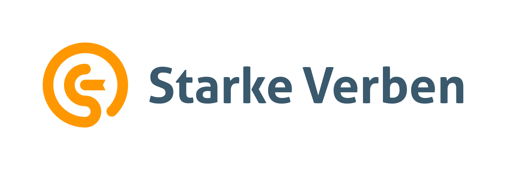
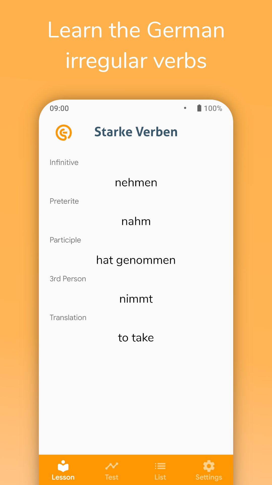
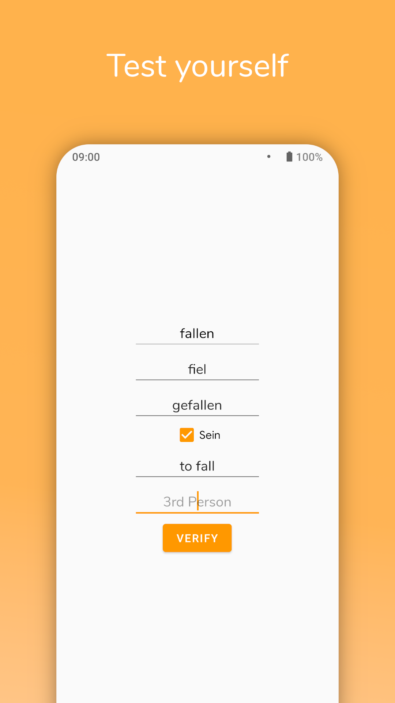
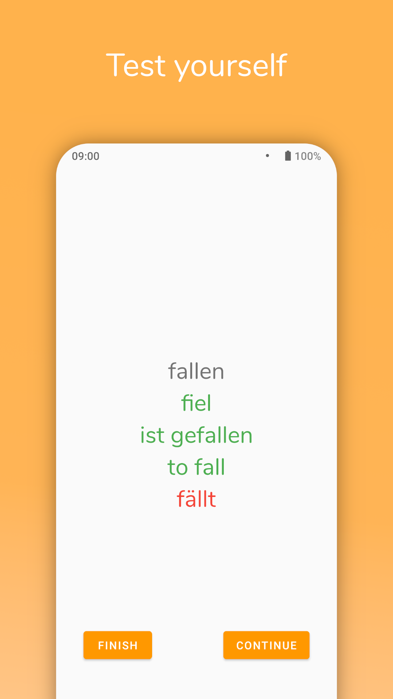
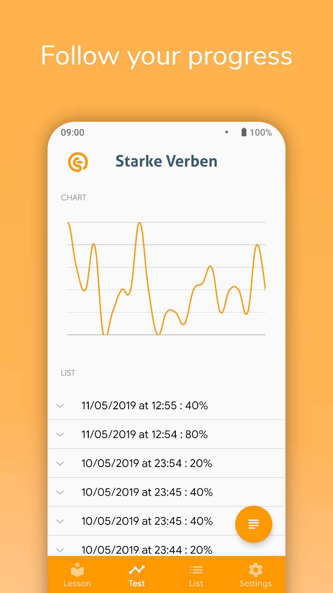
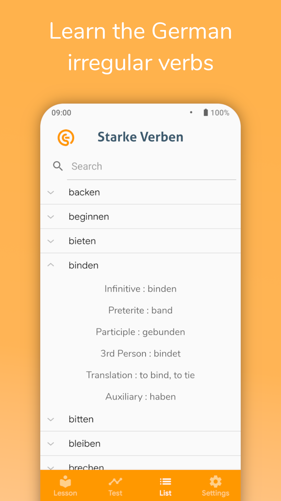

<h1>Starke Verben</h1>

    
    

    
    
    
    

---

## Description
StarkeVerben is an Android application that aims to help people learning the German strong verbs.

## Screenshots
 

## Translation
As it is an application for an educational purpose, we want to reach a large number of people. Thus if you speak a language which is not available in our app, your help is welcome. [Here](https://hosted.weblate.org/projects/starke-verben) is the Weblate page where you can translate the application.

You can contact us for help via [Gitter](https://gitter.im/Sw24Softwares/StarkeVerben).

For other contribution, please see [this](https://github.com/Sw24Softwares/StarkeVerben/blob/master/CONTRIBUTING.md).

## Compiling
In order to compile this application, make sure you have the Android SDK installed and the environment variable `ANDROID_HOME` set to it. Then run `./gradlew assembleDebug` on Linux, or `gradlew.bat assembleDebug` if you are on Windows. The path to the .apk file will be app/build/outputs/apk/app-debug.apk. You can also run gradlew with `installDebug` if your phone is connected via ADB. You can find the build status of the application at [travis-ci](https://travis-ci.org).

## License
This program is released under the GPL3 license. For further information, please read LICENSE file.

The logo was designed by <a href="https://naufal.id">Ahmad Naufal Mukhtar</a>

*Google Play and the Google Play logo are trademarks of Google LLC.*

